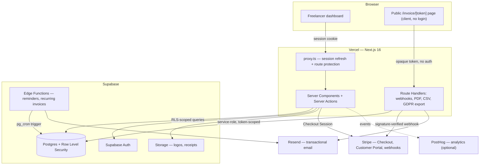

# InvoiceForge

Invoicing and client management for freelancers, consultants, and micro-businesses — built to be deployable on free tiers, not a demo scaffold.

**Stack:** Next.js 16 (App Router, Server Actions, TypeScript strict, Turbopack) · Supabase (Postgres + RLS, Auth, Storage, Edge Functions) · Stripe · Resend · Tailwind CSS v4 + shadcn-style components

## Contents

1. [What's built vs. backlog](#whats-built-vs-backlog)
2. [Architecture](#architecture)
3. [Key design decisions worth knowing](#key-design-decisions-worth-knowing)
4. [Local development setup](#local-development-setup)
5. [Automated reminders & recurring invoices](#automated-reminders--recurring-invoices)
6. [Testing](#testing)
7. [Security notes](#security-notes)
8. [Beyond the original brief](#beyond-the-original-brief)

---

## What's built vs. backlog

This now covers **the full original brief** — every Core MVP Feature, every Non-Negotiable requirement, and all five Stretch/Differentiating Features — fully wired end to end and verified (see [Testing](#testing)):

**Built, wired, and verified:**
- Auth (magic link + Google OAuth), protected routes via `proxy.ts`, GDPR consent capture
- Multi-tenant Postgres schema with Row Level Security on every table, verified against a real Postgres instance with a 20-assertion test suite (tenant isolation, forged-input rejection, atomic writes, privilege lockdown, database-enforced business rules)
- Client management (CRUD + archive)
- Invoice creation: line items, tax, discounts, branding, one-time **and** recurring, PDF generation
- Invoice tracking (draft → sent → viewed → paid/overdue), public client-facing invoice page
- Stripe: client invoice payments (Checkout) **and** SaaS subscription billing (Starter/Pro, Checkout + Customer Portal + webhooks), with idempotent webhook handling
- Reports: revenue/tax summary + CSV export
- GDPR: data export, account deletion (with cascading delete), consent capture, privacy/terms pages, "not tax advice" disclaimers throughout
- Automated reminders and recurring-invoice generation, written as Supabase Edge Functions (see note below on why these aren't live-tested)
- PWA: manifest, installable, generated icons, minimal offline app-shell caching
- PostHog: pageview + key funnel events (signup, invoice created/sent/paid, subscription started/canceled)
- **Expense logging** — categorized, receipt uploads to a private Storage bucket, billable expenses pull into an invoice as line items via a picker in the invoice form
- **Time tracking** — a start/stop timer (one running timer per user, enforced by a database constraint, not just the UI), manual entry, billable hours pull into invoices the same way expenses do
- **Client feedback/request portal** — a two-party message thread on every sent invoice, reachable by the client through the same opaque token as the public invoice page, no new auth system
- **Revenue forecasts** — a Forecast tab on the Reports page, splitting known recurring revenue (simulated forward from active templates) from a trailing-average projection, so the chart doesn't blend a commitment with a guess
- **Invoice template library** — reusable line-item sets, loadable into the invoice form or saved directly from an existing invoice
- Unit tests for money math, CSV export, and the forecast projection; a full production build (`next build`) and lint pass verified clean

**One honest caveat:** the two Edge Functions (`send-invoice-reminders`, `generate-recurring-invoices`) are written against Supabase's documented Deno runtime APIs, but this repo has no live Supabase project to deploy them to and test against. The Postgres-side logic they call (`generate_due_recurring_invoices()`) *is* verified — see [Testing](#testing) — but the Edge Function wrapper itself should get a real smoke test against your own project before you rely on it.

---

## Architecture



**Two separate Stripe flows, one account:** (1) freelancer → InvoiceForge subscription billing (Starter/Pro), (2) client → freelancer invoice payment. Both currently settle into a **single Stripe account** — see [Key design decisions](#key-design-decisions-worth-knowing) for why, and the upgrade path to Stripe Connect for true multi-tenant fund routing.

---

## Key design decisions worth knowing

A few choices worth understanding before you extend this, since they're not obvious from the code alone:

- **Single Stripe account, not Connect.** Client invoice payments currently settle into the platform operator's own Stripe balance, not each freelancer's bank account. That's correct for a single-operator deployment (you're both the platform and the only freelancer) but wrong for a real many-freelancer SaaS — see `lib/stripe.ts` for the Stripe Connect migration path (Express accounts + `on_behalf_of`/`transfer_data.destination`).
- **Public invoice access never uses a public RLS policy.** The `/invoice/[token]` page and its PDF/checkout routes look the invoice up via the service-role client, filtered strictly by the opaque `public_token` — never a client-supplied id. A public `SELECT` RLS policy is the kind of thing that quietly over-exposes rows the moment an unrelated query joins against that table; a narrow, explicit code path is easier to audit.
- **Money is integer pence everywhere** — database columns, Stripe amounts, PDF rendering — never a float. `lib/money.ts` is the single source of truth for totals math, and it's recomputed server-side on every write; the browser's live total is a preview only, never trusted.
- **Invoice numbering is race-safe.** `next_invoice_number()` row-locks the profile (`FOR UPDATE`) before incrementing, so two concurrent "create invoice" requests from the same freelancer can't collide on a number.
- **The Stripe webhook is idempotent.** Stripe explicitly documents that events can be delivered more than once; `processed_stripe_events` turns "handle this event" into an atomic insert-or-detect-duplicate, so a retried delivery can't double-credit a payment or send a client two receipts.
- **`SECURITY DEFINER` functions are explicitly locked down.** Postgres grants `EXECUTE` to `PUBLIC` on every new function by default — for a function that bypasses RLS (like the recurring-invoice generator), that default is a real vulnerability, not a formality. `0008_function_privileges.sql` revokes it and grants back only to the roles that actually need it. This is verified in the test suite, not just asserted in a comment.
- **Invoice line items denormalize `user_id`** onto the child row purely so RLS policies are a plain indexed lookup instead of a join/subquery per row — a trigger forcibly overwrites whatever `user_id` the client sends with the true owner looked up from the parent invoice, so the denormalization can't be exploited to forge ownership.
- **`proxy.ts`, not `middleware.ts`.** Next.js 16 deprecated the `middleware.ts` convention in favour of `proxy.ts` (same job — session refresh, route protection — clearer name for what's actually a network boundary). It always runs on the Node.js runtime now rather than Edge, which has no downside here since `@supabase/ssr`'s session handling doesn't need Edge specifically.
- **The invoice form's line-item editor exposes an imperative handle, not lifted state.** Expenses, time entries, and templates all need to inject rows into the same editor from three different pickers. Rather than lifting all item state into the parent form (a bigger, riskier change to already-tested code), `LineItemsEditor` stays in charge of its own state and exposes `appendItems`/`replaceAllItems` via `useImperativeHandle` — the parent calls in, the editor decides how to apply it.
- **One running timer per user is a database constraint, not a UI check.** `time_entries_one_running_per_user` is a partial unique index (`where ended_at is null`) — even a second browser tab or a retried request can't create a second concurrent timer, because Postgres itself rejects it.
- **The revenue forecast reports two numbers, not one blended guess.** `computeRevenueForecast` separates revenue from *already-active* recurring invoices (simulated forward, about as close to committed as freelance income gets) from a flat trailing-average projection of historical one-off revenue (explicitly a guess). Blending them into a single "forecast" figure would hide how much of it is actually known.
- **Client messages follow the exact same token pattern as invoice payments.** No public RLS policy, no new auth system — a client posts through a server action that looks up the invoice by its opaque `public_token` via the admin client, and `sender` is hard-coded server-side from which action was called, never read from the form. The RLS policy on the table independently enforces the same rule (an authenticated freelancer can only insert with `sender = 'freelancer'`) — two layers agreeing, neither trusting the other to catch it alone.

---

## Local development setup

**Prerequisites:** Node 20+, a Supabase account, a Stripe account, a Resend account, [Supabase CLI](https://supabase.com/docs/guides/cli) (optional but recommended for local Postgres + migrations).

```bash
# 1. Install dependencies
npm install

# 2. Copy env template and fill in real values (see sections below)
cp .env.example .env.local

# 3. Run the database migrations against your Supabase project
#    (via the SQL Editor in the dashboard, or the CLI — see below)

# 4. Start the dev server
npm run dev
```

Open `http://localhost:3000`.

**Useful scripts:**
```bash
npm run dev         # local dev server (Turbopack)
npm run build        # production build
npm run typecheck    # tsc --noEmit
npm run lint          # ESLint
npm run test           # Vitest unit tests
```

---

## Automated reminders & recurring invoices

Both run as scheduled Supabase Edge Functions. After deploying them (see above), schedule with either:

**Supabase Dashboard** → Edge Functions → your function → Cron, using a schedule like `0 8 * * *` (daily, 08:00 UTC).

**Or `pg_cron` directly**, run once in the SQL Editor:
```sql
select cron.schedule(
  'send-invoice-reminders-daily',
  '0 8 * * *',
  $$
  select net.http_post(
    url := 'https://<project-ref>.supabase.co/functions/v1/send-invoice-reminders',
    headers := jsonb_build_object('Authorization', 'Bearer <service-role-key>')
  );
  $$
);
-- repeat for generate-recurring-invoices with its own schedule/time
```

Both functions are idempotent by design (see [Key design decisions](#key-design-decisions-worth-knowing)) — triggering either one twice in a day is safe.

---

## Testing

```bash
npm run test              # Vitest: money math, CSV export, and forecast projection unit tests
npm run typecheck          # tsc --noEmit across the whole app
npm run lint                # ESLint
```

**Database/RLS testing** lives outside `npm test` since it needs a real Postgres instance, not a mock:
```bash
# Requires a local PostgreSQL with a stub auth/storage schema — see
# supabase/tests/00_supabase_stub.sql for what it fakes and why. This is
# what this repo's own build was verified against.
psql -d your_test_db -f supabase/tests/00_supabase_stub.sql
psql -d your_test_db -f supabase/tests/01_roles_and_grants.sql
for f in supabase/migrations/*.sql; do psql -d your_test_db -f "$f"; done
psql -d your_test_db -f supabase/tests/rls_smoke_test.sql
```
This asserts tenant isolation, forged-input rejection on raw inserts and every RPC, atomic multi-table writes, race-safe invoice numbering, that the `SECURITY DEFINER` functions are actually locked down, and the database-enforced business rules added for the stretch features (one running timer per user, a client message can never be inserted with `sender = 'freelancer'` by anyone but the real freelancer) — **20 assertions in total**, each printing `PASS:`/`FAIL:` with a clear reason.

This is a lighter-weight alternative to a full [pgTAP](https://pgtap.org/) suite — if you want to go further, these same assertions port over cleanly into pgTAP `is()`/`ok()` calls.

---

## Security notes

- Every tenant table has RLS enabled with owner-only policies; verified against a real database, not just declared (see Testing).
- The service-role key never reaches the browser and is only imported in server-only files (`lib/supabase/admin.ts`).
- Rate limiting on public/unauthenticated routes (checkout initiation, PDF downloads) is not yet implemented. For a single-operator deployment with modest traffic this is a low-risk gap; before scaling to real strangers hitting your public invoice links, add a distributed limiter (Upstash Redis has a usable free tier) in front of `/invoice/[token]` and its associated API routes.
- All Zod-validated forms sanitize input server-side, not just client-side — the client-side validation is a UX nicety, the server action is the actual boundary.
- File uploads (logos) are size- and MIME-type-restricted at the Storage bucket level, not just in the upload UI.

---

## Beyond the original brief

Every feature in the original brief — Core MVP, Non-Negotiable, and all five Stretch/Differentiating Features — is now built. These are the natural next layers:

- **Stripe Connect**, replacing the single-account model — see [Key design decisions](#key-design-decisions-worth-knowing) for the specific migration path.
- **Rate limiting** on the public/unauthenticated routes (`/invoice/[token]`, its checkout/PDF/message endpoints) — currently undefended against abuse; see [Security notes](#security-notes).
- **Live updates for the message thread** via Supabase Realtime, instead of the current refresh-on-navigation pattern — a natural fit given Realtime is already part of the Supabase stack this uses.
- **A "review before sending" toggle for recurring invoices** — they currently auto-generate *and* auto-send; some freelancers will want a chance to check each one first.
- **Receipt OCR** to auto-fill an expense's amount/date from a photographed receipt, rather than typing it in.
- **A full [pgTAP](https://pgtap.org/) suite**, porting over the assertions already in `supabase/tests/rls_smoke_test.sql` — this repo's tests were deliberately kept dependency-free, but pgTAP is the natural next step if this grows.

## License
This project is proprietary. The source code is publicly visible for portfolio 
and educational purposes only. All rights are reserved. No copying, modification, 
redistribution, or hosting is permitted.